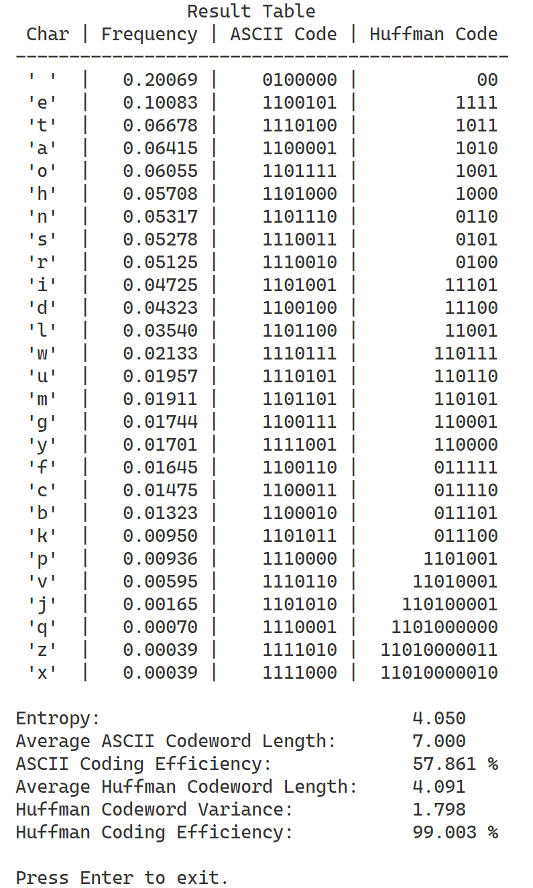

# txt2Huffman
Count the letter frequency of a .txt file and generate Huffman Coding of the 26 English letters and the ‘space’.

We designed two software which are CLI version and GUI version. The GUI version is based on CLI source code and use Gooey library ([link](https://github.com/chriskiehl/Gooey)) to generate graphic user interface. 

You can package .py file to .exe file using Pyinstaller library. Enjoy!

## Screenshot

#### CLI Version

#### GUI Version

